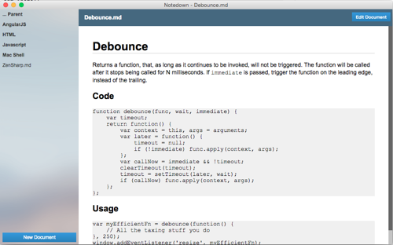
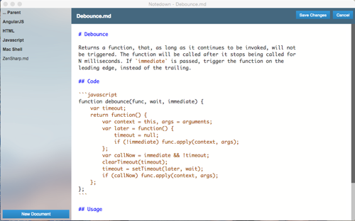

# Notedown

Notedown is a simple AngularJS powered Markdown editor written in Typescript that runs within Node-webkit.

To get it up an running, clone this repo and run

```
npm install -g gulp

npm install
bower install

gulp
```

There will be a built version of Notedown in the dist folder for Windows and OSX.

## Screenshots

### Preview Mode



### Edit Mode


